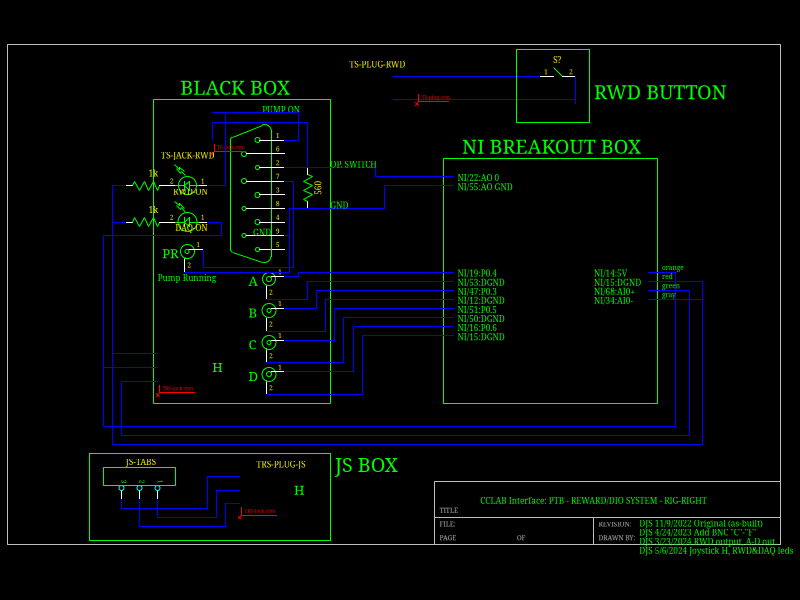
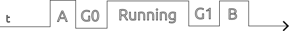

# Measuring reward timing with the NE4000 dual channel pump

CCLAB uses the two-channel NE-4000 syringe pump from [New Era Pump Systems](https://www.syringepump.com/index.php). This pump can be controlled using digital signals from an external source. We use a National Instruments A/D card for this, and we access the card using Matlab's Data Acquisition Toolbox. The pump is connected to our system via a serial cable, which is connected to our break-out box. Signals from Matlab functions, as well as the "god" button, are routed through this cable.

The pump generates a signal (which is available on the breakout box for "Rig-right") that is high when the pump motor is running. Based on email from the company, that signal is set on within 1ms of powering on the motor. Thus, the most accurate way to measure the timing of reward onset is that "Motor running" signal. 

In the absence of that signal, we can still know the approximate onset of the reward *as long as there is a reliable signal adjacent to the reward signal*. I tested this using a script which generated TTL pulses "A" and "B" both before and after a reward of fixed length.

Here, "A" and "B" refer to calls made to cclabPulse('A', 250) and cclabPulse('B', 250), putting 250ms square pulse on to signal lines "A" and "B". The "Running" period is when the pump motor is running. The "G0" and "G1" period are time gaps between the motor onset/offset and the adjacent pulses. *Note that the gaps G0 and G1 are measured relative to when the previous pulse is complete, not when it starts!*

I recorded these three lines, pulse "A", "B", and the "Motor Running" signal, as I issued a series of 10 rewards of fixed size. I did this for three different reward sizes: 250ms, 400ms, and 600ms. 

|t(reward)|A|G0|RWD|G1|B|
|---------|-|--|---|--|-|
|250ms|251.9&pm;0.1ms|163&pm;14ms|249&pm;2ms|47&pm;16ms|251.7&pm;0.4ms|
|400ms|251.9&pm;0.3ms|173&pm;17ms|400.1&pm;0.1ms|35&pm;17ms|251.6&pm;0.4ms|
|600ms|251.6&pm;0.6ms|173&pm;17ms|600.1&pm;0.1ms|43&pm;13ms|251.7&pm;0.5ms|

This is NOT an exhaustive measurement (just 10 samples at each reward length). But the results are consistent, and it appears that you can reliably assume that the reward ONSET occurs approximately 170ms AFTER the marker pulse "A" comes down. 

